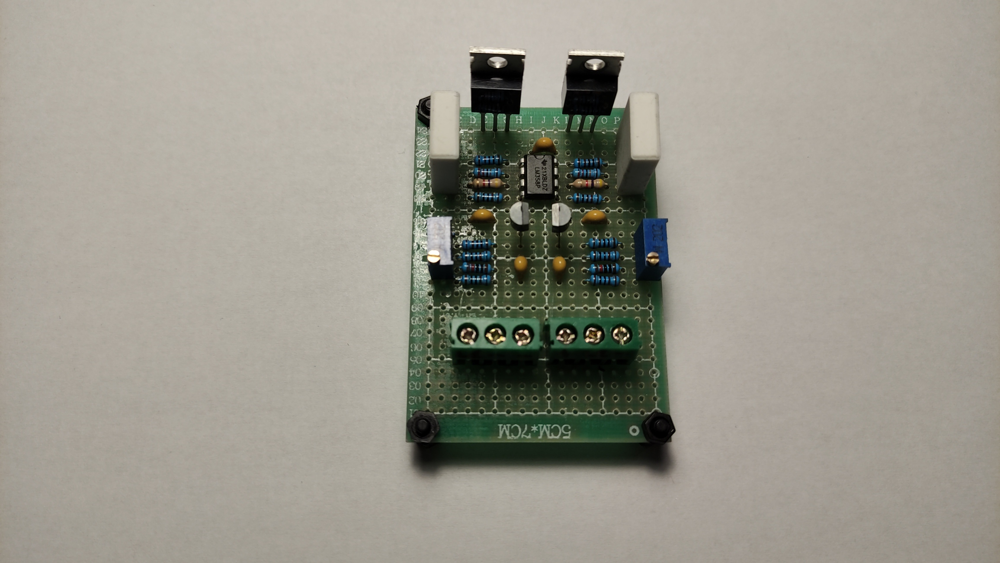
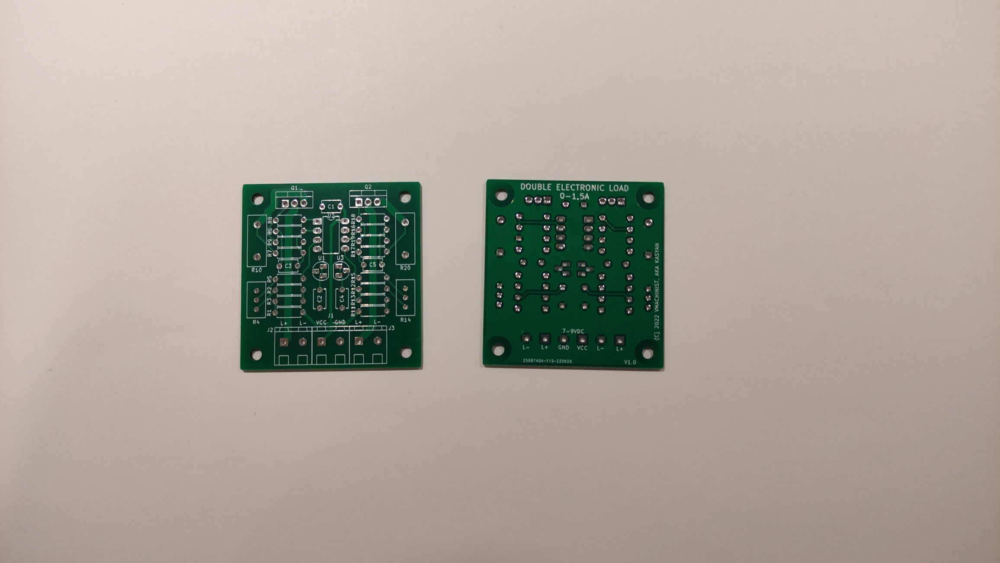
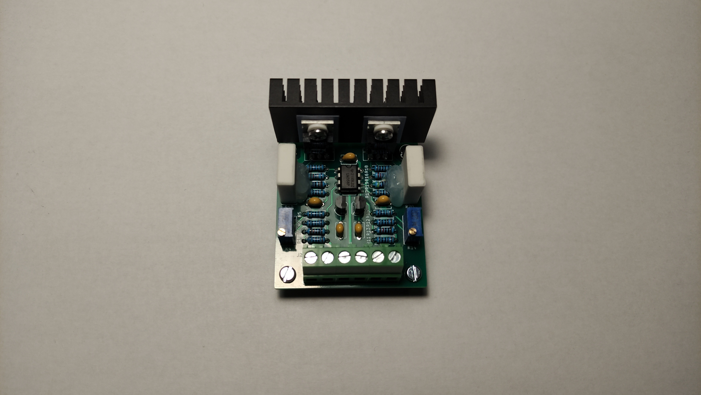

# Double Electronic Load Project

LM358-based double electronic load.

## Motivation

I needed a quick, cheap and simple method of testing the capacity of a rather large batch of small Li-ion cells to bin them and assemble a larger battery.

The testers I obtained to measure the actual capacity (ZB2L3) had a simple 15 Ohm resistor as a load. Measuring capacity with a resistor can be imprecise, because the current drops together with the voltage as the cell discharges and this may give greater capacity than you would normally expect.

There are multiple recipes out there of producing a constant-current load using an op-amp, a voltage reference and a MOSFET. The ones I found interesting are:

* [DIY POWERFUL ELECTRONIC LOAD WITH LM358](https://www.youtube.com/watch?v=7ahOXYocZ3Y) by [KD CREATIVITY](https://www.youtube.com/@kdcreativity6201)
* [Simple battery capacity meter](https://www.youtube.com/watch?v=puiJUjyRxHI) by [AKA KASYAN](https://www.youtube.com/@AkaKasyanEng)
* [Adjustable Constant Current Load - Linear](https://hackaday.io/project/186915-adjustable-constant-current-load-linear) by [Manu](https://hackaday.io/GearBliss)

They however use only one half of LM358 dual op-amp and I had a limited amount of them lying around vs other stuff like TL431 I had bought by the dozens previously, so it made sense to use both halves.

I based my circuit on the one by [AKA KASYAN](https://www.youtube.com/@AkaKasyanEng) and simply doubled everything except the op-amp. You can also use the second half of LM358 to drive a fan depending on the MOSFET temperature, but my discharge current will barely warm up the heatsink, so instead I opted for two semi-independent load cells.

## Parts Used

The parts here don't have to be very precise or even genuine, as long as they're working.

I frequently order stuff from AliExpress in large excess of what I actually need for a project in case some particular seller decides to sell counterfeit that doesn't work properly.

The PCB was ordered as usually from JLCPCB.

Not all parts of the [schematic](images/double-electronic-load.kicad_sch.pdf) are described here.

Some notable part choices:

* The heatsink used is 50x25x10mm, anodized aluminium. Bought for around $0.3 a piece.

* `Q1` and `Q2` are SFP50N06, about $2.5/10 pcs.

* `R10` and `R20` are low-inductance, part no. BPR56, bought for $1.40/10 pcs. Don't have to be low-inductance, but they are more compact than regular 5W resistors.

* `J1`, `J2` and `J3` are LZ128 5mm screw terminal blocks I had lying around, but can be of any other type.

The rest of the parts were in total about $5.

## Using the Load

### Connecting with ZB2L3

The load requires a 7-9V DC 10-20mA power supply for a more stable operation, compared to 5V DC the ZB2L3 uses, so powering it off USB isn't advised. ZB2L3 has a regulator, so it shouldn't be affected by the increased voltage.

* The `L+` terminal must be connected to either one of `R`/`IN+` inputs of the ZB2L3 tester.

* The battery/current source positive lead must be connected to the second `R`/`IN+` input of ZB2L3.

* The `GND` terminal must be tied together with the opposite `R` input of ZB2L3 (i.e. the one closer to `IN-`).

* The battery/current source negative lead must be connected to the `IN-` input of ZB2L3.

* +7-9V DC power supply is connected to both the `VCC` terminal of the load and `DC5V` pad on the underside of the ZB2L3 tester.

### Adjusting the Current

Load current is adjusted using `R4` and `R14` trimmer pots.

## Photos

Early working prototype:

PCBs from JLCPCB:

Fully populated PCB:
